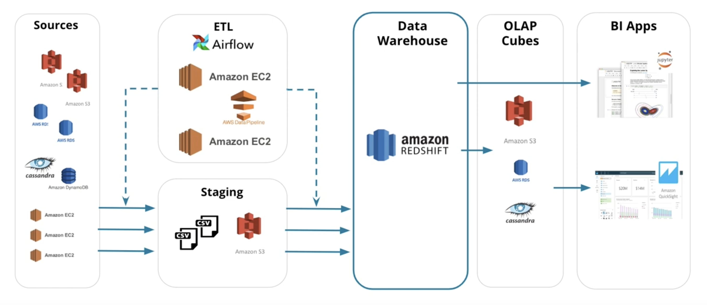

# OVŌM Care
#### Data Warehouse implemented with Apache Airflow

## Defining use case
OVŌM Care is on a mission to redefine how reproductive care is delivered to patients. By combining AI-enabled technology with a human-touch, they elevate the patient experience, establish a new standard in quality of care, and create accessibility. 

For that, they are collecting healthcare records from different sources, and they expect to create high grade data pipelines that are dynamic and built from reusable tasks, can be monitored, and allow easy backfills. We will be responsible for designing, building, and maintaining the data infrastructure and pipelines that power the data-driven applications and the data science team. 

This exercise will be focus on specifics needs for the project:
1. Data system implementation, including data ingestion, storage, transformation to support data-driven applications. Cloud-based solutions. 
2. Design and implement data models and schemas that enable efficient and flexible data access and online analytical process (OLAP). Cloud Data Warehouse implementation. 
3. Optimize data storage and retrieval to ensure fast and reliable data access, while minimizing costs and complexity. 
4. Monitor and troubleshoot data processing systems to ensure their reliability, availability, and performance.

In this exercise we are not having on count: 
1. Data integrations pipelines from different data sources in real-time and batch processing. 
2. Data protection and data privacy constraints. 

## Selected solution
To achieve the exercise requirements we decided to build an ETL pipeline for a cloud data warehouse. We will take advantage of the cloud resources capabilities to create the data system that includes the ingestion, transformation and storage of large volumes of data and enable it for the analytical process.  The ETL pipeline will be implemented with Apache Airflow to ensure the reliability, availability, and performance from the DAG (Direct Analytic Graph).

The advantages of using this solution: 

* The power of the cloud comes from connecting compute and storage resources from many physical servers. 
* **Scalability**. This means large amounts of data can be loaded into the data warehouse environment, processed, and stored faster 
* **flexibility**. This comes from the ability to add and remove different types of resources from data pipelines as needed. 
* **Cost shifting** is a result of leveraging cloud database technology to perform the costly and time-consuming transformation of data as the last part of the process. **Pay as you go**. 
* Airflow is particularly powerful for orchestrating jobs with complex dependencies in multiple external systems. 
  * Ensuring the quality of your data through automated validation checks is a critical step in building data pipelines at any organization.

## Technologies selected
To build our system we will leverage from the following technologies: 

1. Amazon Web Services (AWS): 
   * Redshift database 
   * EC2 computing resources 
   * S3 storage system 
   * IAM users management

2. Apache Airflow

3. Python for data generation

4. SQL for data modeling

## Dataset
OVŌM care aims to create a technology-enabled future in reproductive care. For instance the data sources will be in the healthcare domain. One of the most commanding types of data in the health sector are the Electronic Healthcare Records (EHR). 

For the sake of simplicity we are going to simulate an EHR dataset based on blood tests from patients. In this case we will have:

* **7k Patients**
* **70K blood test records** 

1. **Log data**: An event dataset where the patients are taking blood tests. This set contains the fields:
For the .md I will copy it from the website 
2. **Patient data**: A patient data set with personal information from patients. 

For the data warehouse we are going to use a **star schema** for the DWH.

* Fact table: **bloodtest** -  ap_hi, ap_lo, cholesterol, gluc, smoke, alco, active, cardio, lab_id, patient_id, doc_id, date

* Dimension table:
  * **patient**: patient_id, age, sex, height, weight, first_name, last_name, address
  * **doctor**: doc_id, doc_name, clinic, 
  * **lab**: lab_id, lab_name, city

## Defining data pipeline
The datasets are in JSON format and they will be previously allocated in s3 buckets. 

* **Patient data**: s3://salvig-sst-ovom-airflow/patient_data
* **Log Data**: s3://salvig-sst-ovom-airflow/log_data

To take advantage of the Redshift capabilities, first we will load the data from the s3 buckets to staging tables in the cluster. Once we have all data in the staging tables we will transform it and load it into the star schema.

To complete the project we will build a DAG with different tasks for the Airflow orchestration. All the operators and task instances will run SQL statements against the Redshift database. The queries are provided in the repository.
### Stage task
The stage task is expected to be able to load any JSON formatted files from S3 to Amazon Redshift. The task creates and runs a SQL COPY statement based on the parameters provided. The task's parameters specify where in S3 the file is loaded and what is the target table.
### Fact and dimensions tasks
With dimension and fact tasks, we utilize the provided SQL helper class to run data transformations. Most of the logic is within the SQL transformations and the task is expected to take as input a SQL statement and target database on which to run the query against.

Dimension loads are done with the truncate-insert pattern where the target table is emptied before the load. Thus, we also have a parameter that allows switching between insert modes when loading dimensions. Fact tables are usually so massive that they should only allow to append type functionality.

### Monitoring task
Finally, the data quality operator, which is used to run checks on the data itself. The task's main functionality is to receive one or more SQL based test cases along with the expected results and execute the tests. For each test, the test result and expected result needs to be checked and if there is no match, the operator should raise an exception and the task should retry and fail eventually.

## AWS needs
We have chosen the option of the Redshift serverless cluster to manage and analyze the data. Amazon Redshift Serverless automatically provisions data warehouse capacity and intelligently scales the underlying resources. Amazon Redshift Serverless adjusts capacity in seconds to deliver consistently high performance and simplified operations for even the most demanding and volatile workloads. To connect Airflow with the cluster, we will need 2 things. First AWS user credentials, and a Redshift serverless cluster and its endpoint.

For that the next steps are required:

Create a IAM user with the necessary policies:
* AdministratorAccess
* AmazonRedshiftFullAccess
* AmazonS3FullAccess

## Optimization
Optimizing the way a table is partitioned up into many pisces and distributed across slices on different machines. 

**All**:
* All small tables all replicated on all slices to speed up JOINS
* In general Dimension tables have less rows and are good for ALL distribution
* Also known as broadcasting, because it replicates the tables across the servers

**Sorting key**:
* Defines columns as sorting key
* When data is loaded, rows are sorted before distribution to slices
* This minimizes query time, since each node has a contiguous range of rows based on the sorting key. 
